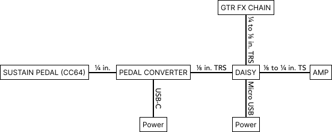

# Simple Stutterer

## To run the patch in Max

Open `stutterer.maxpat`. Configure and turn on audio I/O by in Options->Audio Status. By default, a non-zero CC value from any controller number in any channel would turn on the effect, and a zero value would turn off the effect.

## To use the patch in Daisy

### Prerequisites

Follow instructions [here](https://github.com/electro-smith/DaisyWiki/wiki/1e.-Getting-Started-With-Oopsy-(Gen~-Integration)) to install the toolchain and oopsy package.

### Flashing the Daisy

1. Connect Daisy to the computer. 
2. Enter the system bootloader by holding the BOOT button down, and then pressing and releasing the RESET button.
3. Open `stutterer_daisy.maxpat`. 
4. Press Cmd + S. This will compile the code and upload to the Daisy.

### Diagram

